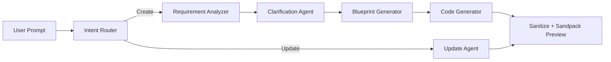

# ORIGIN — AI Code Co-Pilot for Non-Coders

**Hackathon MVP | Text → Live App in Minutes**

> An AI-native command center that turns plain English into live tools.

---

## Slide 1 — Title

**ORIGIN — AI Code Co-Pilot for Non-Coders**

- Hackathon MVP
- Tagline: *Text to App in Minutes*
- Package: `ai-code-co-pilot-for-non-coders`

---

## Slide 2 — Problem

| Pain point | Who feels it |
|------------|--------------|
| Ideas stuck in words, not working software | Students, founders, PMs, designers |
| Coding tools need syntax, repos, setup | Non-technical users |
| Long dev cycles for simple UI prototypes | Hackathons, classrooms, early validation |

**One-liner:** Non-coders have ideas but no fast path from “describe it” to “see it running.”

---

## Slide 3 — Solution

**ORIGIN** accepts a natural-language prompt and returns:

1. Structured **app blueprint** (JSON spec)
2. **React + Tailwind** code (`App.js`)
3. **Live preview** in the browser (no deploy step)

**Example prompts:**

- “Build a BMI calculator with height, weight, and category result”
- “Student grading dashboard with charts and export”
- “Add dark mode” / “Add export button” (iterative updates)

---

## Slide 4 — How It Works (User Flow)

```
User types prompt
    → POST /api/generate
    → Multi-agent pipeline (create OR update)
    → React code + blueprint
    → Sandpack live preview
```

**Two modes:**

| Mode | When | What happens |
|------|------|--------------|
| **Create** | First build or new app requested | Full agent pipeline |
| **Update** | Small change to existing app | Update Agent only (faster) |

**Intent routing** decides create vs update using keywords and patterns (e.g. “build a new…”, “from scratch” → rebuild).

---

## Slide 5 — Tech Stack

| Layer | Technology | Role |
|-------|------------|------|
| **Frontend** | Next.js 14, React 18 | App shell, API routes |
| **Styling / UX** | Tailwind CSS, Framer Motion | Dark UI, animations |
| **Icons** | Lucide React | UI icons |
| **Live preview** | CodeSandbox Sandpack | In-browser React runtime |
| **AI / LLM** | OpenAI SDK | Chat completions |
| **LLM providers** | OpenAI **or** Groq (Llama 3.1) | Configurable via env vars |
| **Package manager** | pnpm | Dependencies |
| **Linting** | ESLint + eslint-config-next | Code quality |

**Environment variables:**

- `OPENAI_API_KEY` / `GROQ_API_KEY` / `LLM_API_KEY`
- `LLM_MODEL`, `LLM_BASE_URL`
- Rate-limit retries, timeouts
- **Demo fallback** when no API key is set

---

## Slide 6 — Architecture (Multi-Agent Pipeline)



| Agent | Responsibility |
|-------|----------------|
| **Intent Router** | Create vs update vs rebuild |
| **Requirement Analyzer** | App type, domain, features, components |
| **Clarification Agent** | 1–2 optional questions to improve build |
| **Blueprint Generator** | JSON app spec (layout, components, sample data) |
| **Code Generator** | Single self-contained `App.js` for Sandpack |
| **Update Agent** | Incremental edits with conversation memory |

**MVP design constraints:**

- Frontend only — no backend, auth, or database in generated apps
- Tailwind-only styling
- Controlled output shape for hackathon reliability

---

## Slide 7 — Key Features

1. **Natural-language app generation**
2. **Live Sandpack preview** + optional code view
3. **Smart update** — refine without full rebuild
4. **Conversation memory** — history passed to agents
5. **Project snapshots** — save prompt, code, blueprint, messages (client-side)
6. **Agent activity trail** — visible steps (Requirement → Blueprint → Code)
7. **Rate-limit handling** — retries for Groq/OpenAI 429 errors
8. **Fallback code** — works when LLM fails or key is missing

---

## Slide 8 — Use Cases

| Segment | Use case | Value |
|---------|----------|--------|
| **Students** | Assignment prototypes, calculators | Learn UI without complex setup |
| **Hackathons** | Idea → demo in minutes | Judge-ready live UI |
| **Startups / PMs** | Validate UX before hiring devs | Cheap discovery |
| **Teachers / workshops** | “Build your first app” labs | No local React install for learners |
| **Designers** | Interactive mockups from text | Faster than static-only designs |
| **Internal tools** | Dashboards, trackers, forms | Quick internal MVP |

**Supported app types (examples):** calculators, dashboards, todo/habit trackers, grading tools, CRM-style UIs, inventory, budgets — anything expressible as a **single React component**.

---

## Slide 9 — Feasibility

| Factor | Assessment |
|--------|------------|
| **Technical** | High — proven stack (Next.js + OpenAI + Sandpack) |
| **Scope** | Bounded — one-file React apps, no backend generation |
| **Time (hackathon)** | MVP working — create, preview, update |
| **Cost** | Low for demo — `gpt-4o-mini` or Groq free tier |
| **Risk** | LLM output quality varies; sanitization + fallbacks mitigate |

**Why it’s feasible:**

- Agents are sequential prompts, not a custom ML pipeline
- Sandpack removes “run locally” friction
- Intent router reduces unnecessary full rebuilds

---

## Slide 10 — Viability

| Strength | Weakness |
|----------|----------|
| Large market (no-code + AI coding) | Crowded space (v0, Bolt, Lovable, etc.) |
| Clear wedge: non-coders + instant preview | Single-file limit for real products |
| Low infra cost for MVP | Depends on third-party LLM pricing |
| Strong for education & prototyping | Not production deployment yet |

**Possible business models (if extended):**

- Freemium: N generations per month
- Teams: shared projects + export to GitHub
- Education: classroom licenses

**Verdict:** Strong **demo + learning product** for hackathons; needs a product roadmap for commercial use.

---

## Slide 11 — Competitive Positioning

| | ORIGIN (this MVP) | Traditional IDEs | Full no-code platforms |
|--|-------------------|------------------|-------------------------|
| **Audience** | Non-coders | Developers | Business users |
| **Input** | Plain English | Code | Drag-and-drop |
| **Output** | Real React code | Full apps | Locked platform |
| **Speed** | Minutes | Hours/days | Hours |
| **Learning curve** | Very low | High | Medium |

**Differentiator:** Controlled, explainable pipeline — each agent step is visible, and output is real React code.

---

## Slide 12 — Limitations

- One **self-contained** `App.js` — not multi-page apps or real APIs
- No persistent **cloud database** or user accounts in generated apps
- Quality depends on **LLM** and prompt clarity
- Generated code runs in **Sandpack sandbox** (good for demo, not full production)
- Not a replacement for production engineering (testing, CI/CD, auth)

---

## Slide 13 — Future Improvements

### Short term

- Export to **ZIP / GitHub**
- **Clarification UI** in chat before build
- **Template library** (BMI, todo, gradebook starters)
- Better errors when Sandpack compile fails

### Medium term

- Multi-file projects (components folder)
- Optional **Supabase / Firebase** scaffold
- User accounts + **cloud project save**
- **Version history** and diff view

### Long term

- Smaller or **local model** for offline/low-cost use
- **Collaborative** editing
- One-click deploy (**Vercel / Netlify**)
- **Accessibility & test** generation
- Domain-specific agents (education, health, etc.)

---

## Slide 14 — Success Metrics (Hackathon)

| Metric | Target |
|--------|--------|
| Time to first preview | Under 2 minutes |
| Successful generation rate | Over 80% on demo prompts |
| Update vs full rebuild | Updates feel under ~30 seconds |
| Demo scenarios | 3 prepared prompts (create → update → rebuild) |

---

## Slide 15 — Demo Script (2–3 minutes)

1. Open app → **ORIGIN** splash screen
2. Prompt: *“Build a BMI calculator with height, weight, and category result”* → **Generate App**
3. Show **agent steps** → **live preview**
4. Prompt: *“Add dark mode and a reset button”* → **update mode**
5. Prompt: *“Build a student grade dashboard instead”* → **rebuild**
6. Optional: open **full preview** tab or toggle **code view**

---

## Slide 16 — Closing

**What we built:** A hackathon MVP for controlled, component-level React generation with live Sandpack preview and a multi-agent orchestrator.

**Ask the audience:** Feedback on agent transparency, use cases in their domain, and which feature to build next.

---

## Appendix — Tech Cheat Sheet

```
Frontend:  Next.js 14 + React 18 + Tailwind + Framer Motion
Preview:   @codesandbox/sandpack-react
Backend:   Next.js API route → runOrchestrator()
AI:        OpenAI API (or Groq via LLM_BASE_URL)
Agents:    Requirements → Clarify → Blueprint → Code | Update
Safety:    sanitizeCode, fallbackAppCode, JSON extract fallbacks
```

### Project structure (high level)

```
src/
  agents/          # orchestrator, codeGenerator, updateAgent, etc.
  components/      # PreviewPanel, ChatPanel, OriginBrand
  pages/           # index.js, api/generate.js
  prompts/         # LLM prompt templates
  sandbox/         # Sandpack file setup
  utils/           # intent, sanitizeCode, conversation
```

### Run locally

```bash
pnpm install
pnpm dev
```

Set `OPENAI_API_KEY` or `GROQ_API_KEY` in `.env` for live AI generation.
